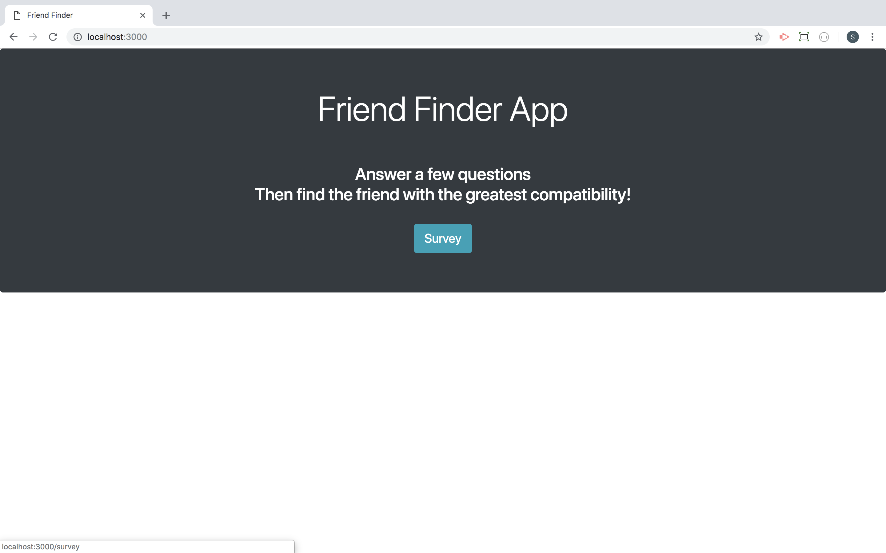
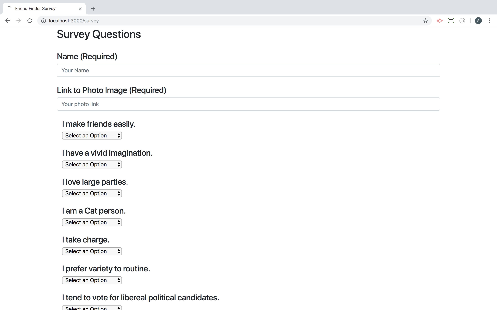
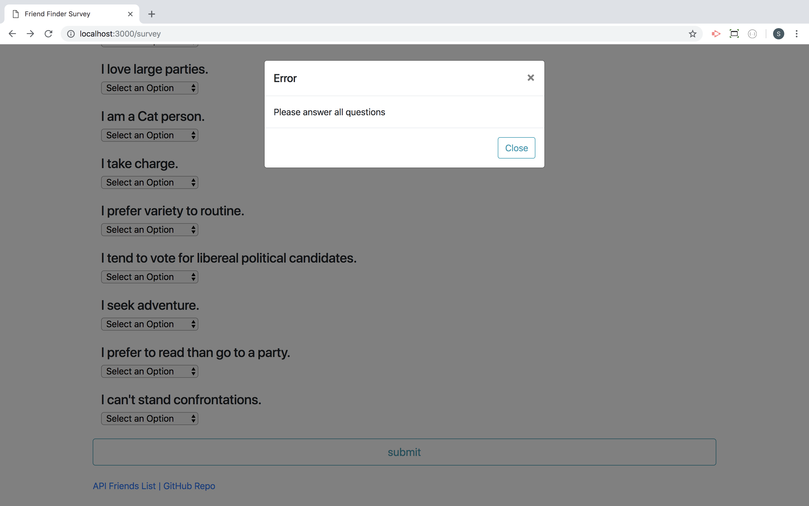
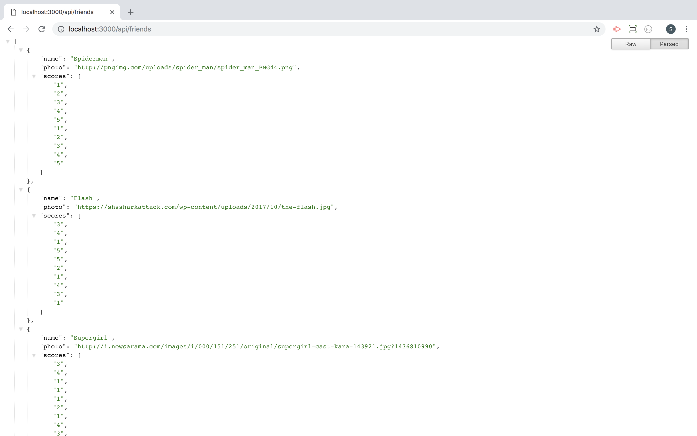
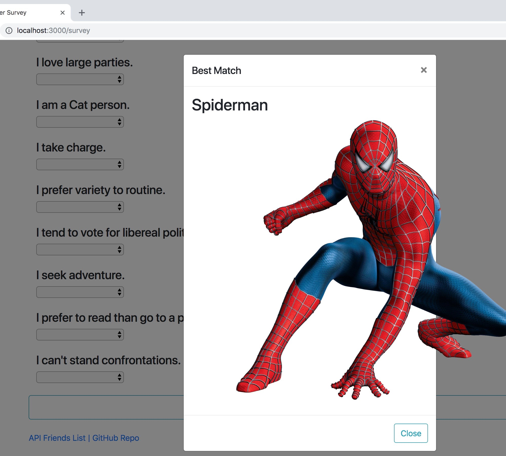

# Friend Finder - Node and Express Servers

### Overview

In this activity, I built a compatibility-based "FriendFinder" application -- basically a dating app. This full-stack site takes in results from a user survey, then compares their answers with those from other users. The app then displays the name and picture of the user with the best overall match. 

I used Express to handle routing and deployed the app to Heroku.

The survey asks 10 personality determining questions. Each answer is on a scale of 1 to 5 based on how much the user agrees or disagrees with a question.

   * The survey answers are then used to compare the difference between current user's scores against those from other users, question by question. 
   
   * The closest match to the user is one with the least amount of difference.

   * The current user's most compatible friend, is then displayed as a modal pop-up.

Here is a screen shot of the home screen:

 

Here are two screen shots of the survey questions:

 

 

Here is a screen shot of the Error message while validating all data entered by user:

 

Here is a screen shot of the JSON file of users data used to fine matches for new users:

 

Here is a screen shot of the Best Match!

 

### Technologies Used
  node.js
  Express
  Javascript
  jQuery
  HTML
  Bootstrap
